# Azure AI Incident Response

An event-driven cloud incident response and operational monitoring workflow built on Microsoft Azure using Azure Monitor, Azure Functions, Log Analytics, Logic Apps, and Ollama-based AI analysis.

The project automates incident enrichment, structured reporting, operational notifications, and alert deduplication to simulate practical cloud operations and support engineering workflows.

---

## Project Overview

This project was designed to simulate a real-world operational monitoring and incident response workflow where Azure Monitor alerts trigger automated incident triage and AI-assisted operational analysis.

Instead of forwarding raw monitoring alerts directly to operators, the workflow normalizes alert context, enriches incidents using AI-generated analysis, validates structured output, applies deduplication logic, and stores incident reports in Log Analytics for operational visibility.

The project focuses on operational engineering concepts commonly used in cloud support and incident management environments, including:

- Event-driven monitoring workflows
- AI-assisted incident analysis
- Alert normalization and context enrichment
- Structured operational reporting
- Notification deduplication and suppression
- Log Analytics ingestion pipelines
- Operational visibility and alert triage

---

## Key Features

- Event-driven incident response workflow using Azure Monitor and Azure Functions
- AI-enriched incident analysis using locally hosted Ollama models
- Alert context normalization before AI processing
- Structured JSON-based incident reporting
- Log Analytics ingestion using Azure Data Collection Rules (DCR)
- Logic App email notification workflow
- Notification deduplication and suppression handling
- AI response validation and fallback incident handling
- Operational visibility using custom Log Analytics tables
- Secure environment-variable-based configuration management

---

## Architecture Diagram

The following architecture demonstrates the end-to-end operational workflow implemented in this project.

The workflow begins with Azure Monitor alert generation and progresses through automated incident enrichment, AI-assisted analysis, structured Log Analytics ingestion, and operational notification delivery.

Key design goals included:

- Reducing manual alert triage effort
- Enriching raw alerts with operational context
- Preventing duplicate notifications
- Maintaining structured incident visibility
- Improving operational response workflows

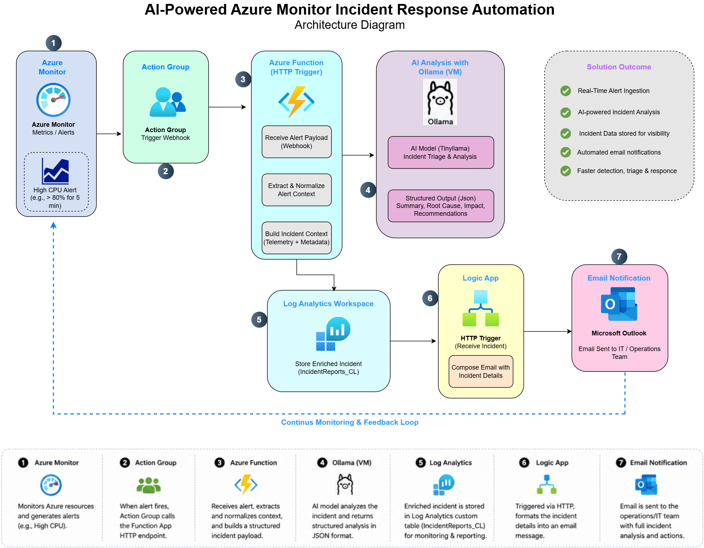

---

## End-to-End Workflow

The incident response workflow follows an event-driven operational pipeline:

1. Azure Monitor detects a monitored infrastructure or application condition.
2. An Azure Monitor Action Group triggers the HTTP-based Azure Function workflow.
3. The function extracts and normalizes alert context from the incoming payload.
4. Relevant operational fields are transformed into a structured AI prompt.
5. Ollama generates AI-assisted incident analysis and recommended actions.
6. AI responses are validated, normalized, and cleaned before downstream processing.
7. Structured incident reports are written into Log Analytics using Data Collection Rules (DCR).
8. Deduplication logic checks for recently processed incidents to reduce alert noise.
9. Logic Apps send operational notifications for non-duplicate incidents.
10. Support teams receive enriched operational incident summaries instead of raw monitoring alerts.

---

## AI Incident Analysis and Alert Normalization

A core objective of this project was to enrich operational alerts with structured AI-assisted incident analysis instead of forwarding raw Azure Monitor alerts directly to support teams.

Before AI processing, the workflow extracts and normalizes operationally relevant alert fields to improve prompt consistency and reduce unnecessary monitoring noise.

The workflow uses structured prompt engineering, JSON response formatting, response cleanup logic, and fallback operational summaries to improve the reliability and consistency of AI-generated incident analysis.

### Alert Context Normalization

This section of the workflow extracts and normalizes Azure Monitor alert fields before AI processing.

The normalization layer standardizes operational context across different Azure resource types and monitoring payload structures.

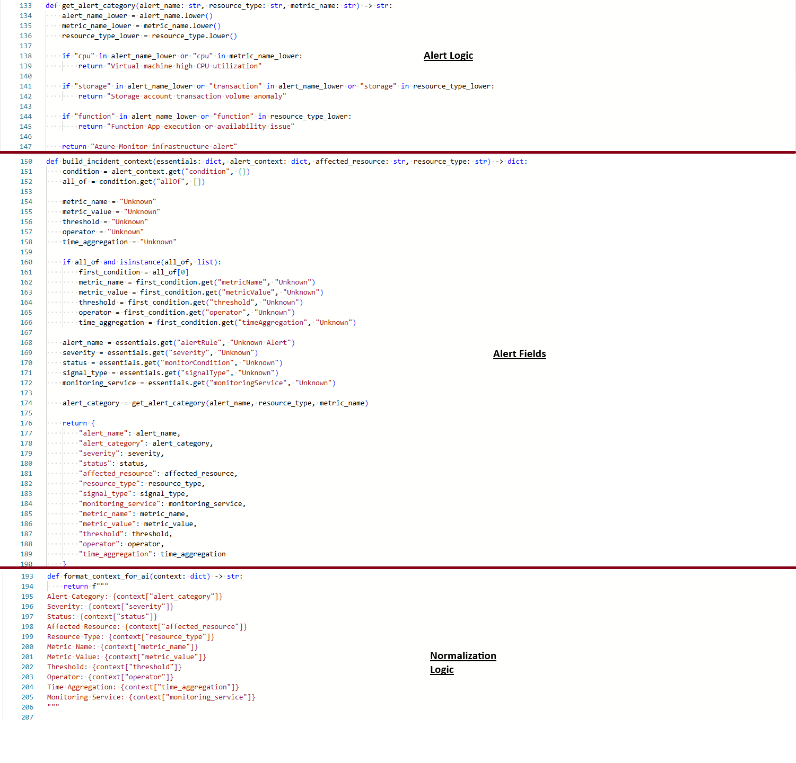

### AI Prompt Engineering and Response Analysis

The workflow uses constrained prompts and structured JSON output formatting to improve AI response consistency.

The response processing logic validates, cleans, and normalizes AI-generated content before operational ingestion.

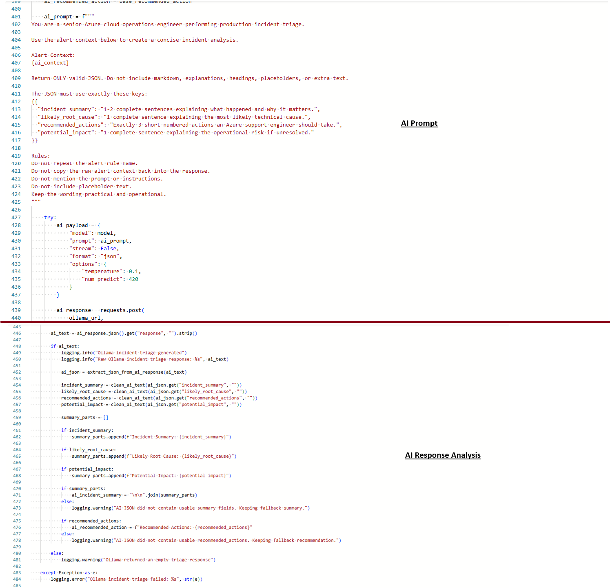

### Ollama AI Integration

The following screenshot demonstrates the Ollama API integration used for AI-assisted incident analysis generation.

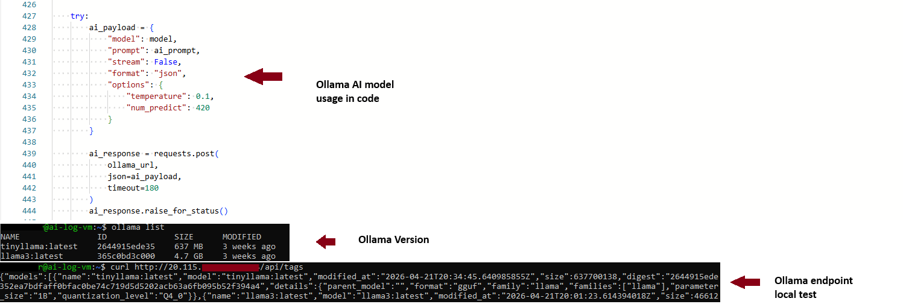

### AI-Enriched Incident Analysis Example

This screenshot demonstrates an example of the generated AI-assisted operational incident analysis, including:

- Incident summary
- Likely root cause
- Recommended actions
- Potential operational impact

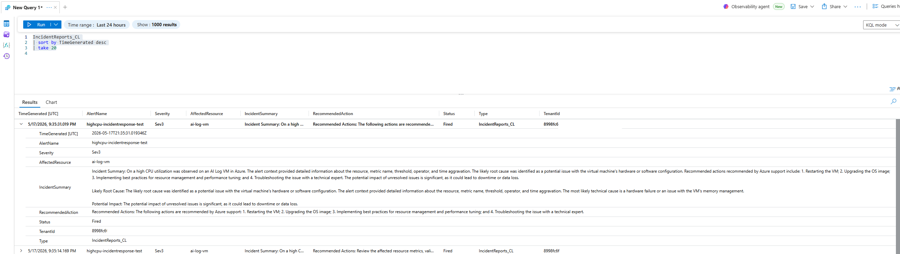

---

## Structured Reporting and Deduplication

Instead of generating free-form operational alerts, the workflow creates structured incident reports before ingestion into Log Analytics.

Each processed incident contains normalized operational fields such as:

- Alert name
- Severity
- Affected resource
- Incident summary
- Recommended actions
- Incident status
- Timestamp metadata

The workflow also includes deduplication and suppression logic to reduce repeated notifications for the same incident condition.

Duplicate suppression is based on combinations of:

- Alert name
- Affected resource
- Incident status

This helps reduce operational alert fatigue while still allowing new or changed incidents to generate notifications.

### Function App Operational Logging

The following screenshot demonstrates Azure Function execution logging during incident processing and Log Analytics ingestion operations.

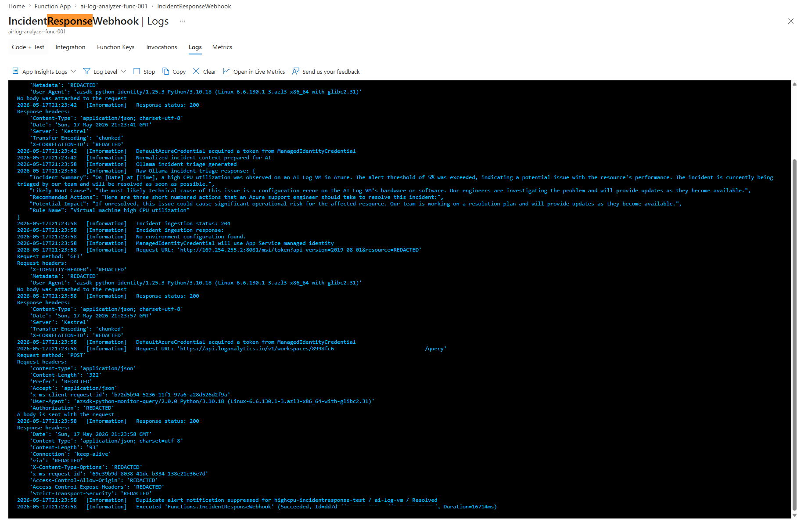

### Logic App Notification Workflow

Logic Apps are used to generate operational email notifications after AI enrichment and duplicate suppression validation.

This ensures operators receive enriched and actionable incident summaries instead of raw alerts.

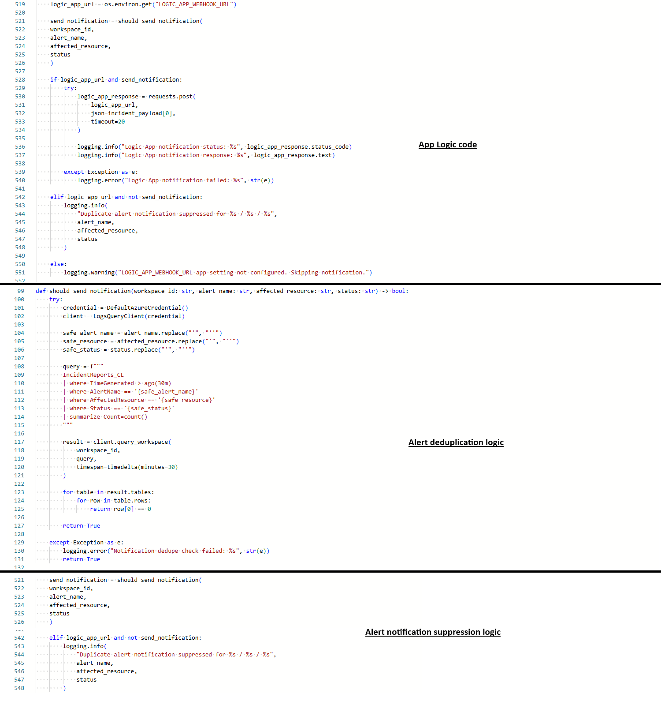

### Email Notification Example

The following screenshot demonstrates the operational email notification generated by the workflow after incident processing and AI enrichment.

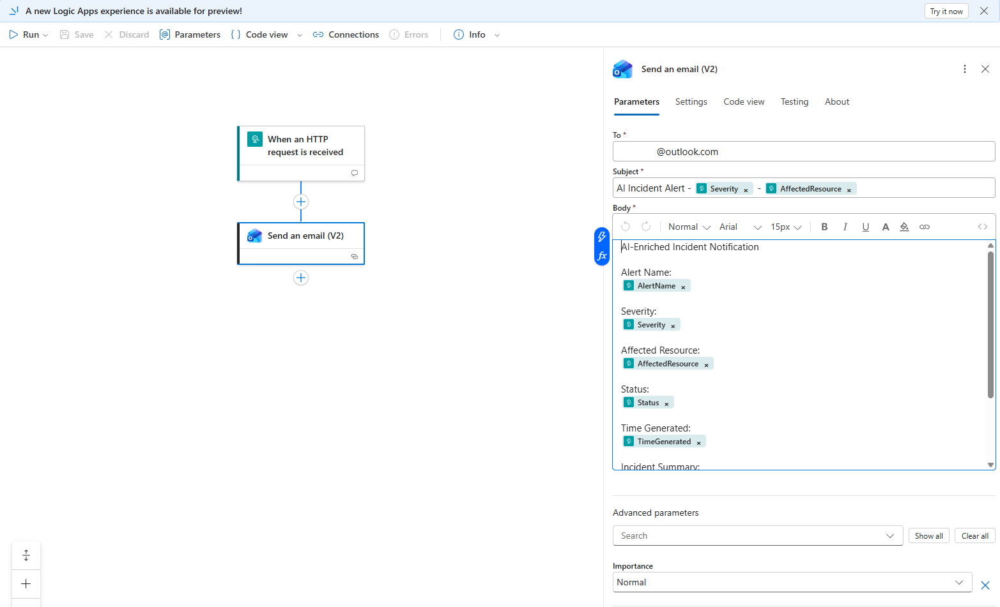

### Sample Structured Incident Report

The repository includes a sanitized sample incident report demonstrating the final operational payload generated by the workflow.

```text
sample-data/sample-incident-report.json
```

---

## Screenshots and Workflow Walkthrough

### Azure Resource Group Overview

The following screenshot highlights the Azure resources used to support the incident response workflow, including monitoring, ingestion, AI analysis, and notification services.

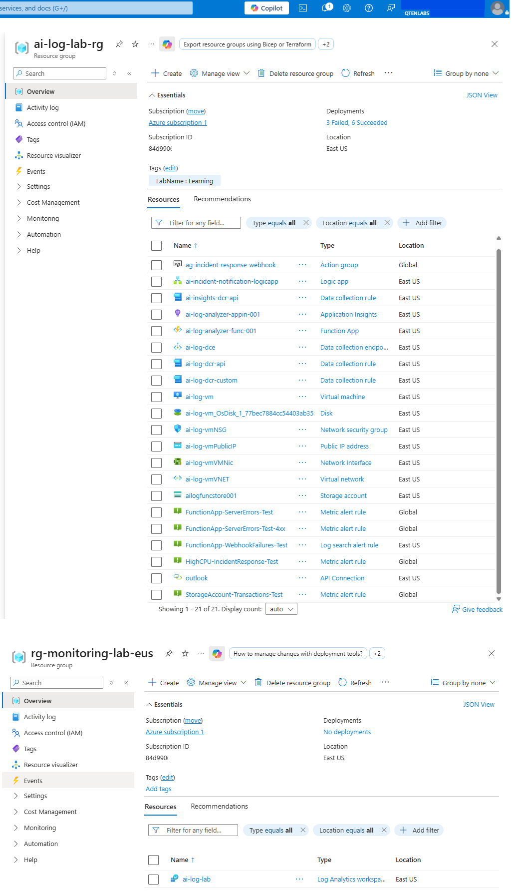

---

### Azure Monitor Alert Configuration

This alert monitors operational conditions within Azure resources and triggers the event-driven workflow through Azure Monitor Action Groups.

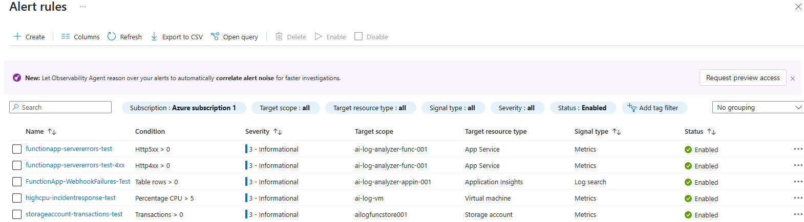

---

### Azure Function Workflow

The Azure Function hosts the core incident response workflow, including:

- Alert normalization
- AI enrichment
- Incident reporting
- Notification suppression
- Log Analytics ingestion

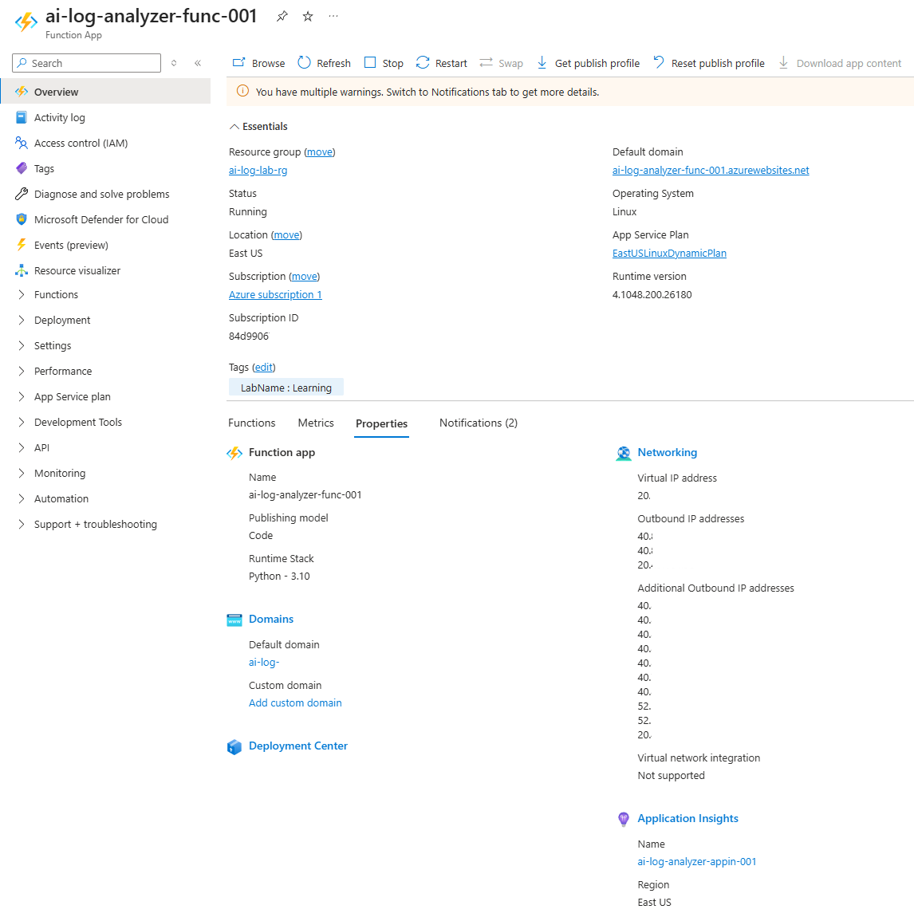

---

### Function App Processing Logic

The following screenshot highlights sections of the Azure Function workflow responsible for operational processing, AI integration, ingestion handling, and incident orchestration.

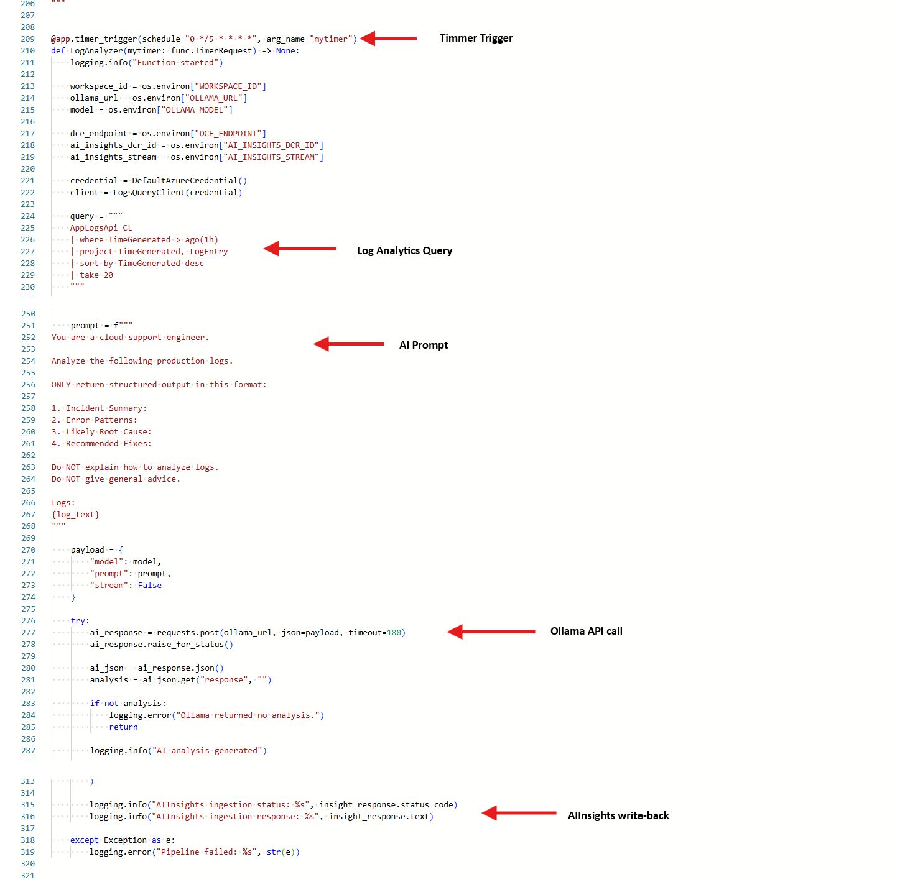

---

### End-to-End Operational Workflow

This screenshot demonstrates the completed workflow across Azure Monitor, Azure Functions, AI analysis, Log Analytics ingestion, and Logic App notification delivery.

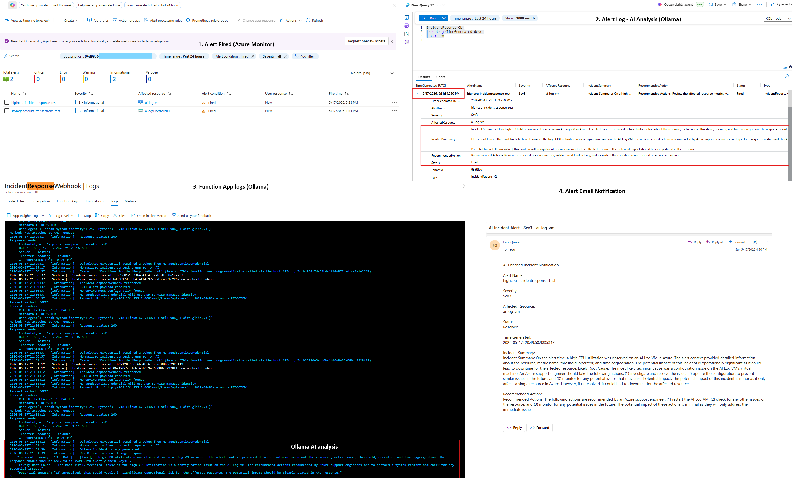

---

## Engineering Challenges and Lessons Learned

This project included several operational and engineering challenges across Azure monitoring, ingestion pipelines, AI response handling, and event-driven workflow automation.

Key challenges included:

### Azure Monitor and Log Analytics Ingestion

- Troubleshooting Data Collection Rule (DCR) and Data Collection Endpoint (DCE) associations
- Resolving ingestion authorization and token scope issues
- Validating custom Log Analytics table mappings and stream configuration
- Debugging ingestion response failures and malformed payload handling

### AI Response Reliability

- Handling inconsistent or malformed AI-generated JSON responses
- Designing structured prompts for predictable operational output
- Implementing response cleanup and normalization logic
- Building fallback operational summaries when AI analysis failed

### Operational Alert Processing

- Normalizing inconsistent Azure Monitor alert payload structures
- Extracting meaningful operational context across different alert types
- Reducing duplicate operational notifications
- Improving incident readability for downstream workflows

### Event-Driven Workflow Design

- Designing an event-driven architecture instead of relying solely on polling workflows
- Integrating Azure Monitor Action Groups with HTTP-triggered Azure Functions
- Coordinating downstream ingestion and notification workflows reliably

This project significantly improved hands-on experience with:

- Azure operational monitoring workflows
- Incident response automation
- Log Analytics ingestion pipelines
- AI-assisted operational analysis
- Event-driven cloud architecture
- Structured operational telemetry handling

---

## Future Improvements

Potential future enhancements for this project include:

- Multi-alert correlation and incident grouping
- Severity-based escalation workflows
- Automated remediation for predefined conditions
- Dashboard visualization using Azure Workbooks or Power BI
- Integration with ticketing platforms such as ServiceNow or Jira
- Support for additional monitoring sources and telemetry pipelines
- Advanced anomaly detection and trend analysis

---

## Project Structure

```text
azure-ai-incident-response/
│
├── architecture/
│   └── azure-ai-incident-response-architecture.png
│
├── function_app/
│   ├── function_app.py
│   ├── host.json
│   └── requirements.txt
│
├── images/
│   ├── ai-incident-analysis.png
│   ├── ai-prompt-logic-fields-normalization.png
│   ├── ai-prompt-response-analysis.png
│   ├── azure-monitor-alert.png
│   ├── email-notification.png
│   ├── end-to-end-workflow.png
│   ├── function-app-log.png
│   ├── function-app-overview.png
│   ├── function-app-code-overview.png
│   ├── logic-app-notification-workflow.png
│   ├── ollama-api-integration.png
│   └── resource-group-overview.png
│
├── sample-data/
│   └── sample-incident-report.json
│
├── .gitignore
├── local.settings.json.example
└── README.md
```

---

## About This Project

This project was built to strengthen hands-on experience with Azure operational monitoring, incident response automation, AI-assisted analysis workflows, and event-driven cloud engineering patterns commonly used in modern support engineering and cloud operations environments.
